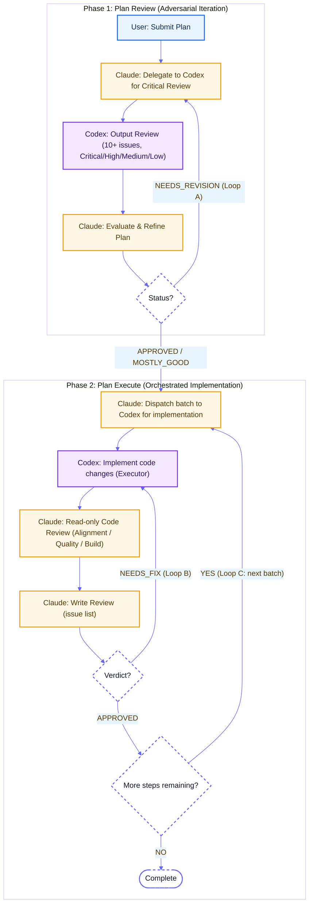

# Claude-GPT Workflow Skills

[中文](./README_zh.md) | English

A collection of Claude Code skills for Claude + GPT automatic collaboration workflows.

## Skills

### 1. [codex](./codex/)
Delegates coding tasks to Codex CLI for execution. CodeX is a cost-effective, strong coder — great for batch refactoring, code generation, multi-file changes, and multi-turn implementation tasks.

Based on [oil-oil/codex](https://github.com/oil-oil/codex).

**Usage:**
```bash
~/.claude/skills/codex/scripts/ask_codex.sh "Your request"
```

### 2. [plan-review](./plan-review/)
Reviews a technical plan via Codex and iteratively refines it. Uses adversarial review to improve plan quality before implementation.

**Trigger:** `/plan-review <plan-file-path>`

### 3. [plan-execute](./plan-execute/)
Executes a finalized plan by delegating coding to Codex. Claude orchestrates, Codex codes, Claude reviews, Codex fixes — iterating until quality passes.

**Trigger:** `/plan-execute <plan-file-path>`

> **Note**
>
> After Claude enters `plan` mode, plan files are stored under `~/.claude` by default. You can change the plan storage directory in `~/.claude/settings.json`; for example, the config below stores plans in the current project's `./plans` directory:
>
> ```json
> {
>   "env": {},
>   "plansDirectory": "./plans"
> }
> ```

## Installation

### Option 1: npx add-skill (Recommended)

**Prerequisite:** Install the add-skill CLI first:
```bash
npm install -g add-skill
```

Then install the skills:
```bash
npx add-skill longranger2/claude-gpt-workflow
```

### Option 2: Per-skill installation

Install individual skills separately:
```bash
npx add-skill longranger2/claude-gpt-workflow/plan-review
npx add-skill longranger2/claude-gpt-workflow/plan-execute
npx add-skill longranger2/claude-gpt-workflow/codex
```

### Option 3: Manual installation

Copy skills to your Claude Code skills directory:
```bash
cp -r plan-review/ ~/.claude/skills/
cp -r plan-execute/ ~/.claude/skills/
cp -r codex/ ~/.claude/skills/
```

## Workflow



### Core Concepts

| Concept | Description |
|---------|-------------|
| **Adversarial** | Codex acts as a "nitpicker", not an assistant — its job is to find flaws |
| **Iterative** | Not one-shot; multiple rounds of back-and-forth until quality gates pass |
| **Role Separation** | User defines what, Claude orchestrates how, Codex executes |
| **Feedback Loops** | Review → Fix → Re-review cycles (Loops A, B, C) |

### The Three Loops

- **Loop A (Plan Refinement)**: Review finds issues → Refine plan → Re-review → ... → APPROVED
- **Loop B (Code Fixing)**: Code review finds bugs → Codex fixes → Re-review → ... → APPROVED  
- **Loop C (Batch Processing)**: Complete current batch → Next batch → ... → All done

## License

MIT
