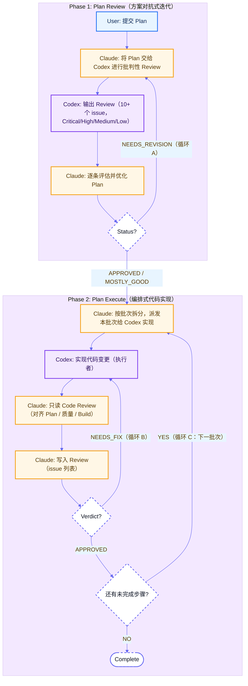

# Claude-GPT 工作流 Skills

[English](./README.md) | 中文

Claude Code Skills 集合，实现 Claude 与 GPT (Codex) 自动协作工作流。

## Skills

### 1. [codex](./codex/)
将编码任务委托给 Codex CLI 执行。CodeX 是一个成本效益高、能力强的 coder — 非常适合批量重构、代码生成、多文件修改和多轮实现任务。

基于 [oil-oil/codex](https://github.com/oil-oil/codex)。

**用法：**
```bash
~/.claude/skills/codex/scripts/ask_codex.sh "Your request"
```

### 2. [plan-review](./plan-review/)
通过 Codex 对技术方案进行评审并迭代优化。在实施前使用对抗式评审提升方案质量。

**触发：** `/plan-review <plan-file-path>`

### 3. [plan-execute](./plan-execute/)
通过委托 Codex 执行来实施最终方案。Claude 编排、Codex 编码、Claude 评审、Codex 修复 — 迭代直到质量达标。

**触发：** `/plan-execute <plan-file-path>`

## 安装

### 方式一：npx add-skill（推荐）

**前置条件：** 先安装 add-skill CLI：
```bash
npm install -g add-skill
```

然后安装 skills：
```bash
npx add-skill longranger2/claude-gpt-workflow
```

### 方式二：单独安装

单独安装各个 skill：
```bash
npx add-skill longranger2/claude-gpt-workflow/plan-review
npx add-skill longranger2/claude-gpt-workflow/plan-execute
npx add-skill longranger2/claude-gpt-workflow/codex
```

### 方式三：手动安装

复制 skills 到你的 Claude Code skills 目录：
```bash
cp -r plan-review/ ~/.claude/skills/
cp -r plan-execute/ ~/.claude/skills/
cp -r codex/ ~/.claude/skills/
```

## 工作流



### 核心概念

| 概念 | 说明 |
|------|------|
| **对抗性 (Adversarial)** | Codex 不是助手而是"挑刺者"——它的工作是找毛病 |
| **迭代性 (Iterative)** | 不是一次通过，而是多轮往返直到质量门通过 |
| **角色分离 (Role Separation)** | User 定义做什么，Claude 编排怎么做，Codex 执行 |
| **反馈闭环 (Feedback Loops)** | Review → Fix → Re-review 的循环（循环 A、B、C）|

### 三个循环

- **循环 A（方案精修）**: Review 发现问题 → 优化方案 → 再 Review → ... → APPROVED
- **循环 B（代码修复）**: Code Review 发现 bug → Codex 修复 → 再 Review → ... → APPROVED
- **循环 C（批次处理）**: 完成当前批次 → 下一批次 → ... → 全部完成

## License

MIT
